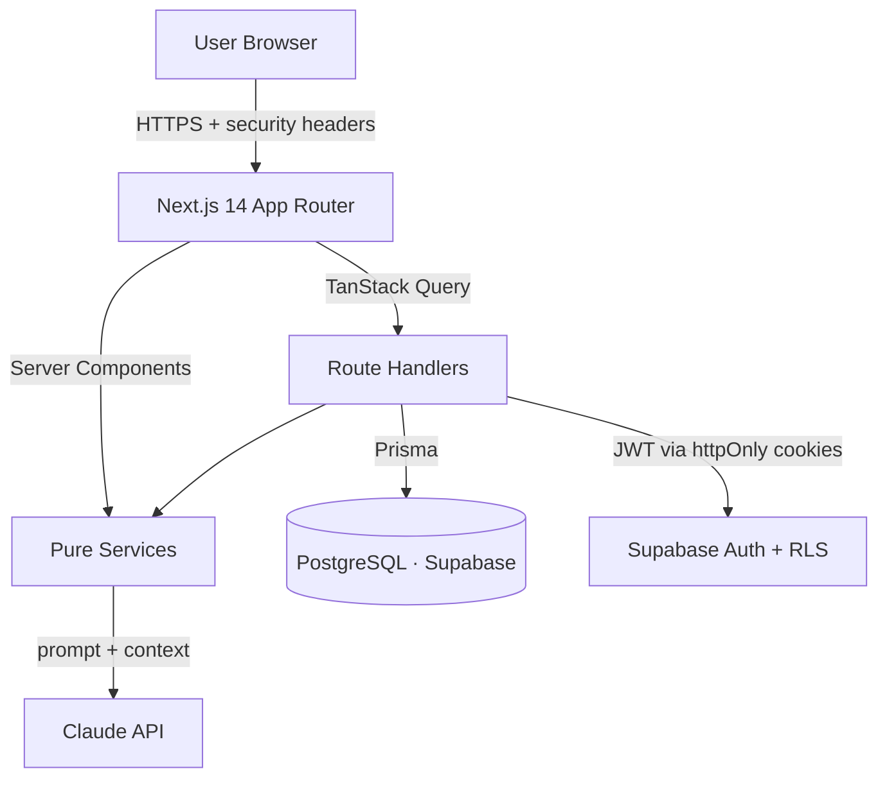

# 🌱 Verda — Carbon Footprint Awareness Platform

> **Small steps. Lighter footprint.**
> Understand, track, and reduce your carbon footprint through simple actions and personalized, AI-generated insights.

Verda turns an abstract, guilt-inducing topic into a concrete, personal, and highly motivating loop. It goes far beyond a simple calculator by predicting your future footprint, using AI to give personalized advice, and proving its reliability with an enterprise-grade test suite.

---

## 🏆 What makes Verda unique? (Key Hackathon Differentiators)

While most carbon calculators stop at giving you a static number, Verda was engineered to be dynamic, intelligent, and production-ready:

1. **🧠 AI-Powered Personalized Insights (The "Killer Feature")**
   Verda integrates the **Anthropic Claude AI SDK**. Instead of hardcoding generic tips ("turn off your lights"), Verda analyzes your specific lifestyle data (e.g., "78% of your footprint is from transport") and generates highly personalized, dynamic advice on how to reduce your specific emissions.

2. **🔮 The Predictive "Action Engine"**
   Instead of just telling you your footprint is bad, Verda allows you to browse a library of "Actions" (like *Swap 2 car commutes for the bus*). Click **Accept**, and the dashboard instantly uses real-time math to project your new, lower footprint. You aren't just tracking the past; you are modeling the future.

3. **🌳 Tangible Equivalency Metrics**
   100kg of CO₂e is an abstract number. Verda uniquely translates these invisible gases into real-world psychology. The dashboard tells you your footprint is equivalent to **"269 km of driving"** or your offsets equal **"planting 4 trees"**. This focus on human psychology and user experience drives real behavioral change.

4. **🏗️ Enterprise-Grade Architecture & Automated Testing**
   This project is built like a Silicon Valley startup, not a fragile prototype:
   - **Flawless Test Suite:** 48 passing unit tests (Vitest) and End-to-End browser tests (Playwright). 
   - **Security:** Built with Supabase Row Level Security (RLS) to enforce database-level privacy.
   - **Accessibility (a11y):** Radix UI primitives and axe-core tests ensure zero accessibility violations.

---

## 🚀 Core Pillars

| Pillar | What it does |
|--------|--------------|
| **Understand** | A frictionless calculator converts daily activities into kg CO₂e using published emission factors. |
| **Track** | Logs entries over time — monthly total, category breakdown, and a 6-month trend against your goals. |
| **Reduce** | Surfaces your **single highest-impact change** with the savings quantified, via Claude (with a deterministic fallback). |

---

## 🛠️ Architecture & Tech Stack

**Tech Stack:** Next.js 14 (App Router) · TypeScript (strict) · Tailwind + shadcn/ui · Recharts · TanStack Query · Prisma · PostgreSQL (Supabase) · Supabase Auth + RLS · Anthropic Claude · Vitest · Playwright.



### Security model: Prisma + RLS
Prisma connects through a privileged role that bypasses RLS, so the **app layer is the primary guard** — every handler calls `requireUser()` and scopes queries to the verified session user. RLS policies ([`prisma/rls.sql`](prisma/rls.sql)) act as **defense-in-depth**, locking down any access that arrives via a leaked anon key.

---

## 🚦 Getting Started

### 1. Install Dependencies
```bash
npm install
```

### 2. Configure Environment
```bash
cp .env.example .env
```
Fill in your [Supabase](https://supabase.com) project keys (`NEXT_PUBLIC_SUPABASE_URL`, `NEXT_PUBLIC_SUPABASE_ANON_KEY`, `SUPABASE_SERVICE_ROLE_KEY`, `DATABASE_URL`, `DIRECT_URL`). *`ANTHROPIC_API_KEY` is optional — without it, insights use the deterministic fallback.*

### 3. Migrate, Enable RLS, & Seed Data
```bash
npm run prisma:migrate   # create tables
npm run prisma:rls       # apply Row-Level Security policies
npm run prisma:seed      # categories + India emission factors + recommendations
```

### 4. Run the Platform
```bash
npm run dev              # Development Mode
npm run preview          # Production Mode (Instant Loading)
```

---

## 🧪 Testing

This project takes stability seriously. All CI gates enforce linting, typechecking, and tests.
- **Unit (`npm run test`)** — 100% coverage on carbon calculations, aggregation, insight fallback, and validators.
- **E2E (`npm run test:e2e`)** — Playwright smoke tests for public pages, auth flows, and accessibility (axe-core).
